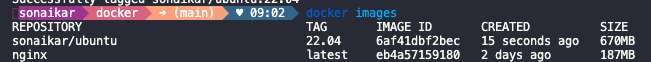
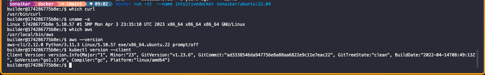

# Instructions to build and push docker image

- Build docker image
```bash
docker build -t sonaikar/ubuntu:22.04 .
```



- Run docker container
```bash
docker run -it --name intuitivedocker sonaikar/ubuntu:22.04
```



- Push docker image to registry
```bash
docker push sonaikar/ubuntu:22.04
```

